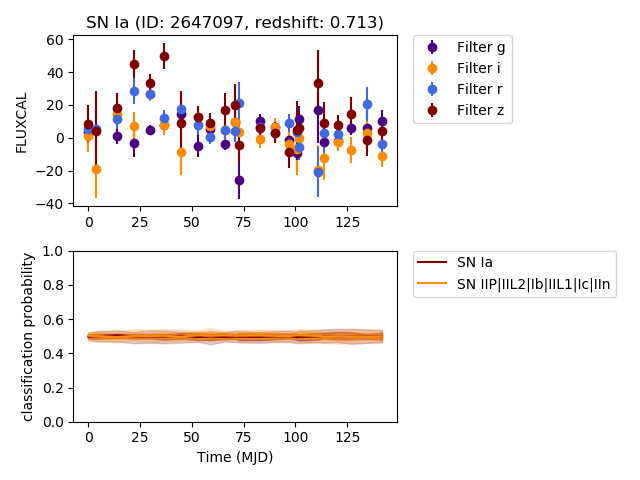

# SuperNNova

- Paper: https://arxiv.org/pdf/1901.06384.pdf
- Repo: https://github.com/supernnova
- Docs: https://supernnova.readthedocs.io/en/latest/
    - FAQs: https://supernnova.readthedocs.io/en/latest/installation/FAQ.html
- Zenodo data: https://zenodo.org/record/3265189#.X4cpz5NKjOR


## Set up in Cloud Shell

[How Cloud Shell Works](https://cloud.google.com/shell/docs/how-cloud-shell-works)
    - When you start Cloud Shell, it provisions a [e2-small Google Compute Engine](https://cloud.google.com/compute/docs/machine-types) virtual machine running a Debian-based Linux operating system.

Following instructions in docs -> environment config, quick start, on the fly
```bash
mkdir SNN
cd SNN
# get recommended conda config file
wget https://raw.githubusercontent.com/supernnova/SuperNNova/master/env/conda_env_cpu_linux64.txt .
# create conda env
conda create --name snn --file conda_env_cpu_linux64.txt
conda activate snn
# install SNN
pip install supernnova
conda activate snn

# get example file to run SNN as a module using included train/test data
wget https://raw.githubusercontent.com/supernnova/SuperNNova/master/sandbox/example_run_modular_snn.py

# clone the repo to get the test input data (prev step is now unnecessary)
git clone https://github.com/supernnova/supernnova.git supernnova
cd supernnova
```


## Check examples on test data
```bash
cd SNN/supernnova
python example_run_modular_snn.py
```
- output in `tests/dump/models/vanilla_S_0_CLF_2_R_none_photometry_DF_1.0_N_global_lstm_32x2_0.05_128_True_mean`
- [Output description](https://supernnova.readthedocs.io/en/latest/installation/five_minute_guide.html#train-an-rnn)

### SNN as a module test
```bash
cd SNN
mkdir moduletest
mkdir moduletest/tests
mkdir moduletest/tests/dump
mkdir moduletest/tests/fits
cp -r supernnova/tests/raw moduletest/tests/. # copy SNN-included test data
cd moduletest

conda activate snn
ipython
```
```python
import supernnova.conf as conf
from supernnova.data import make_dataset
from supernnova.training import train_rnn
from supernnova.validation import validate_rnn
from supernnova.validation import metrics
from supernnova.paper import superNNova_plots as sp
from supernnova.paper import superNNova_thread as st
from supernnova.visualization import visualize
from supernnova.visualization import early_prediction

args =  conf.get_args()

#-- create database
args.data = True 						# conf: making new dataset
args.dump_dir = "tests/dump" 			# conf: where the dataset will be saved
args.raw_dir = "tests/raw"				# conf: where raw photometry files are saved
args.fits_dir = "tests/fits"			# conf: where salt2fits are saved
settings = conf.get_settings(args) 		# conf: set settings
make_dataset.make_dataset(settings)		# Build an HDF5 database
# https://supernnova.readthedocs.io/en/latest/data/index.html
# This creates a database for all the available data with 80/10/10 train/validate/test splits.
# The database is saved to the specified dump_dir, in the processed subfolder.

#-- train model
args.data = False						# conf: no database creation
args.train_rnn = True					# conf: train rnn
args.model = 'bayesian'                 # conf: use bayesian rnn
args.dump_dir = "tests/dump" 			# conf: where the dataset is saved
args.nb_epoch = 2						# conf: training epochs
settings = conf.get_settings(args) 		# conf: set settings
train_rnn.train(settings)				# train rnn
# https://supernnova.readthedocs.io/en/latest/training/index.html
# All outputs are dumped to tests/dump/models/bayesian_S_0_CLF_2_R_none_photometry_DF_1.0_N_global_lstm_32x2_0.05_128_True_mean_Bayes_0.75_-1.0_-7.0_4.0_3.0_-1.0_-7.0_4.0_3.0/
# trained classifier saved as *.pt
# loss curves saved as train_and_val_loss_*.png
# training statistics: training_log.json

# validate (test set classificatio)
args.data = False						# conf: no database creation
args.train_rnn = False					# conf: no train rnn
args.validate_rnn = True				# conf: validate rnn
args.dump_dir = "tests/dump" 			# conf: where the dataset is saved
settings = conf.get_settings(args) 		# conf: set settings
validate_rnn.get_predictions(settings)	# classify test set
metrics.get_metrics_singlemodel(settings, model_type="rnn")
# https://supernnova.readthedocs.io/en/latest/validation/index.html
# predictions on a test set saved as PRED_*
# metrics on the test set saved as METRICS_*
args.metric_files = ['tests/dump/models/bayesian_S_0_CLF_2_R_none_photometry_DF_1.0_N_global_lstm_32x2_0.05_128_True_mean_Bayes_0.75_-1.0_-7.0_4.0_3.0_-1.0_-7.0_4.0_3.0/METRICS_bayesian_S_0_CLF_2_R_none_photometry_DF_1.0_N_global_lstm_32x2_0.05_128_True_mean_Bayes_0.75_-1.0_-7.0_4.0_3.0_-1.0_-7.0_4.0_3.0.pickle']
args.prediction_files = ['tests/dump/models/bayesian_S_0_CLF_2_R_none_photometry_DF_1.0_N_global_lstm_32x2_0.05_128_True_mean_Bayes_0.75_-1.0_-7.0_4.0_3.0_-1.0_-7.0_4.0_3.0/PRED_bayesian_S_0_CLF_2_R_none_photometry_DF_1.0_N_global_lstm_32x2_0.05_128_True_mean_Bayes_0.75_-1.0_-7.0_4.0_3.0_-1.0_-7.0_4.0_3.0.pickle']
settings = conf.get_settings(args) 		# conf: set settings
sp.plot_calibration(settings)           # plot calibration
# outputs a figure in path/to/dump_dir/figures showing how well a given model is calibrated
sp.science_plots(settings)              # make science plots
# does not work
# output figures in path/to/dump_dir/figures showing various plots of interest: Hubble residuals, purity vs redshift etc.
metrics.aggregate_metrics(settings)
st.SuperNNova_stats_and_plots(settings)
# output a csv file in path/to/dump_dir/stats, which aggregates various performance metrics for each model that has been trained and for which a METRICS file has been created.

# plot lightcurves
visualize.visualize(settings)
# not working
# outputs tests/dump/explore/*.png
early_prediction.make_early_prediction(settings,nb_lcs =20,do_gifs=False)
# Outputs: a figure folder under tests/dump/lightcurves/*
# https://supernnova.readthedocs.io/en/latest/visualization/index.html

```


#### plot things
- pred vs time
- look at saved pngs
- look in `tests/dump/lightcurves`
- look in `tests/dump/figures`
- load/look at `PRED*.pickle`
- https://supernnova.readthedocs.io/en/latest/validation/index.html#science-plots

```bash
# on Roy
# download a plot
wget https://970-cs-893939707442-default.us-east1.cloudshell.dev/files/download/?id=b9cf48f3-d405-489b-88d0-6b71e688a099 figures/.
# not working, manually download from cloud shell
```




## deploy to GCE
- train on full data from paper (or perhaps from plasticc)
- use `supernnova/run_onthefly.py` template to classify new lc
- create filter/subscription based on: https://github.com/ZwickyTransientFacility/ztf-avro-alert/blob/master/notebooks/Filtering_alerts.ipynb
