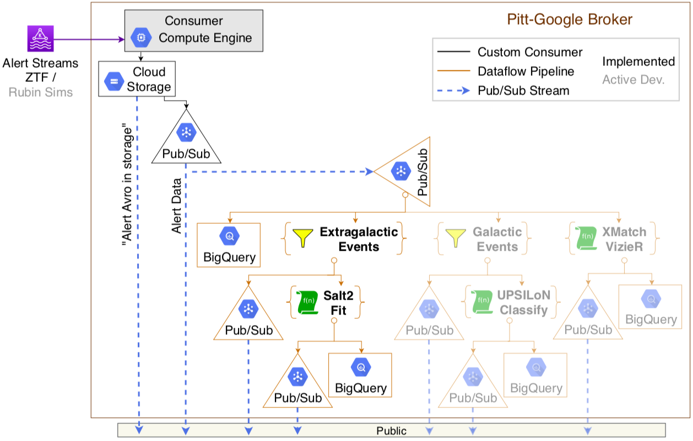

# Group Meeting Updates

## Dec 18, 2020

__Dark Matter in Stars Paper:__
1. Submitted. Received reviewer comments.
    - Resolved all comments but one... waiting to meet with Andrew
2. Will resubmit as soon as I can resolve ^ with Andrew.

__Alert Broker for ZTF and LSST:__
1. Gave talk about our status at Rubin LSST Community Alert Broker Workshop
2. Submitted proposal to be accepted as an LSST Community Alert Broker
3. Broker software currently working:
    - Receive/ingest live ZTF alerts
    - Store: file in Cloud Storage; data in BigQuery database
    - Filter for likely extragalactic transients
        - Fit with Salt2. Store results in BigQuery (fit params) \& Cloud Storage (figure: lightcurve + Salt2 fit)
    - Generate live message streams via Pub/Sub after each processing stage

4. Next steps:
    1. Work on Consumer: connection to ZTF is inconsistent/unstable
        - Implement testing from a local machine (outside of broker software)
        - Fix the connection (several options; newly discovered __Kafka -> Pub/Sub connector__)
    2. Look into errors reported in the broker logs
    3. Clean up the Beam pipeline code and submit a PR
    4. Fix loading of alerts to BigQuery database. Currently dropping cutouts and all alerts that fail the initial upload attempt (mostly 1st detections)
    5. Work on "Active Dev." items (cross matching and variable stars classifications)

---
## Dec 4, 2020

__Question:__

1. submitting a correction to [alert-stream-simulator#writing-your-own-consumer](https://github.com/lsst-dm/alert-stream-simulator#writing-your-own-consumer)

__Upcoming:__

2. Rubin LSST alert broker proposal due __Dec. 15__

__ZTF Alert Stream Consumer:__ [[Dashboard](https://console.cloud.google.com/monitoring/dashboards/builder/3a371dcb-42d1-4ea0-add8-141d025924f6?project=ardent-cycling-243415&dashboardBuilderState=%257B%2522editModeEnabled%2522:false%257D&timeDomain=1d) ]

3. on Nov 30th, 'magically' regained access to streams starting with Nov 25th.
    - currently ingesting 2 days at a time
4. Rewriting workflow -> Apache Beam pipeline (w/ Dataflow runner)
    - will attempt 1st run this weekend

__Salt2 fits:__

5. [done] Successfully fit ZTF alerts! [[Dataflow job](https://console.cloud.google.com/dataflow/jobs/us-central1/2020-12-03_20_59_17-16682442575249541749;step=?project=ardent-cycling-243415)]
    - fit params stored in BigQuery db
    - lightcurve figure png stored in GCS bucket

__Cross matching with Vizier service:__

6. Haven't tried yet (recently). Will try (briefly) this weekend.

__Rubin LSST simulated alerts:__ [[Dashboard](https://console.cloud.google.com/monitoring/dashboards/builder/a431efde-cc61-49db-939c-fb3b9715eb4b?dashboardBuilderState=%257B%2522editModeEnabled%2522:false%257D&project=ardent-cycling-243415&timeDomain=1d) ]

7. [done] Alert Stream Simulator:
    - Successfully running (publishing public Kafka stream) [[VM Dashboard](https://console.cloud.google.com/monitoring/dashboards/resourceDetail/gce_instance,project_id:ardent-cycling-243415,zone:us-central1-a,instance_id:30795360064810098?project=ardent-cycling-243415&timeDomain=1d)]
8. Ingest the stream:
    - Trouble reading the alert packets in Beam pipeline (`cannot encode a null byte`). Instead:
    1. [done] Wrote simple consumer to:
        - listen to Kafka stream
        - extract alert data
        - store as Avro file in GCS bucket
        - publish alert (bytes) to PubSub stream
    2. Writing Beam pipeline to:
        - listen to PubSub stream
        - parse the alert
        - write to BigQuery table
        - data processing??? (random data in simulated alerts)
